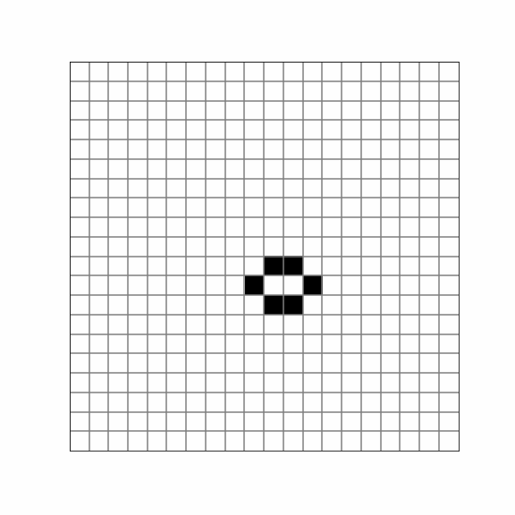
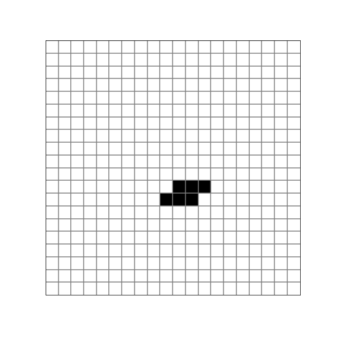
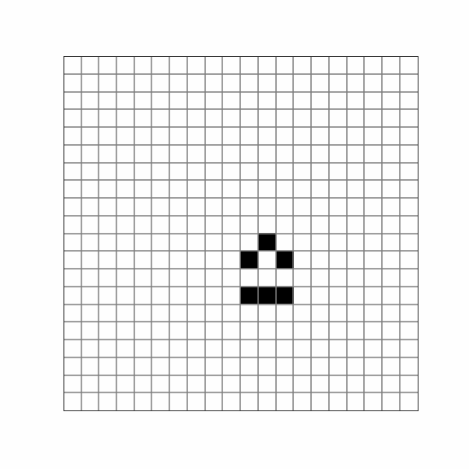
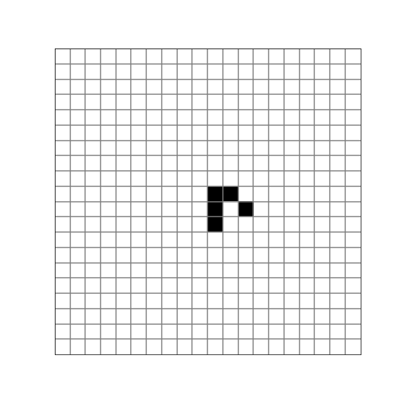
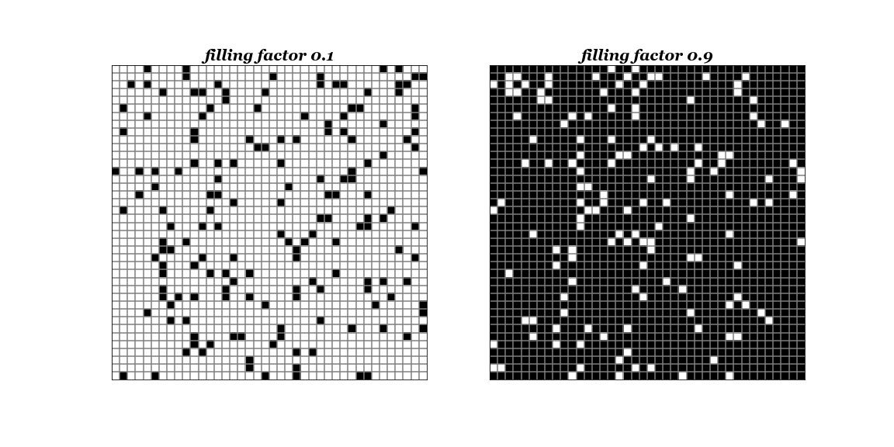
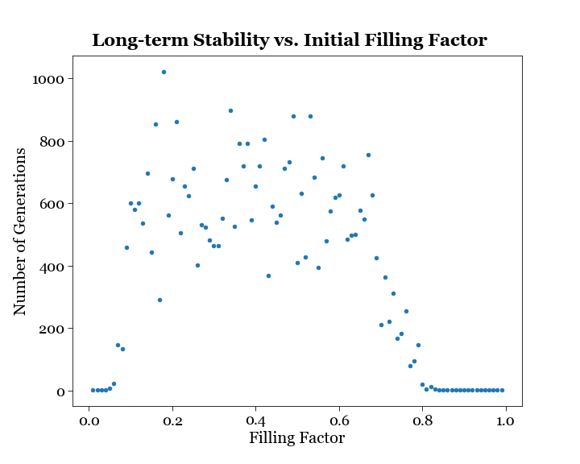

# Emergence
Emergence is the unexpected complexity and structure generated out of simple building blocks, subject to disorder, but constrained by a few rules. This chapter discusses a few examples.

## Ising Model
The Ising model is a mathematical model of ferromagnetism in statistical mechanics, with the following features - 
1. The model is defined on a regular _**lattice**_, such as a one-dimensional chain, a two-dimensional square lattice, or a three-dimensional cubic lattice.

1. Each lattice site has a _**spin**_ that can be in one of two states: spin-up (+1) or spin-down (-1). Symbolically, each site $k$ has a spin $\sigma_k$ such that $\sigma_k \in (-1, 1)$. 

1. The energy of the system is determined by a _**Hamiltonian**_, which specifies how spins interact with their neighbors and with an external magnetic field. The Hamiltonian for the Ising model is, 
$$H(\sigma) = -\sum J_{ij} \sigma_i \sigma_j - \mu \sum_j h_j \sigma_j$$
where $\sigma$ is the configuration, $H$ is the Hamiltonian, sites $i, j$ are nearest neighbors with interaction $J_{ij}$, $\mu$ is the magnetic moment, $h_j$ is an external magnetic field. The first part of the Hamiltonian describes spin-spin interaction, and the second part of the Hamiltonian describes spin-field interaction.

   If $J_{ij}>0$, $\uparrow \uparrow$ and $\downarrow \downarrow$ are energetically favored, and the interaction is ferromagnetic; if $J_{ij}<0$, $\uparrow \downarrow$ and $\downarrow \uparrow$ are energetically favored, and the interaction is antiferromagnetic; if $J_{ij}=0$, the spins are noninteracting. 

   If $h_j>0$ the spin site $j$ desires to line up in the positive direction; if $h_j<0$ the spin site $j$ desires to line up in the negative direction; if $h_j=0$, there is no external influence on the spin site.

1. The Ising model can be used to calculate the _**partition function**_, which, in turn, allows for the computation of various thermodynamic properties such as magnetization, specific heat, and susceptibility. The partition function is,
$${Z_\beta} = \sum_\sigma e^{-\beta H(\sigma)}$$

1. The _**configuration probability**_ is given by the Boltzmann distribution with inverse temperature $\beta \geq 0$:
$$P_\beta(\sigma) = \frac{e^{-\beta H(\sigma)}}{Z_\beta}$$
where $\beta=(k_\beta T)^{-1}$, and $Z_\beta$ is the partition function. For any observable $X$ as a function of spins, the _**expectation**_ (statistical average) of $X$ is given by, 
$$\langle X \rangle_\beta = \sum_\sigma X(\sigma) P_\beta(\sigma) = \frac{1}{Z_\beta} \sum_\sigma X(\sigma) e^{-\beta H(\sigma)}$$

1. The Ising model exhibits _**phase transitions**_, where the system undergoes a spontaneous change in its order. The most famous phase transition predicted in the Ising model is the ferromagnetic phase transition, where spins align and the material becomes magnetized. 

1. Due to the complexity of solving the Ising model analytically, numerical techniques like _**Monte Carlo simulations**_ are often used to study the behavior of the model and explore its phase transitions. An example is the Metropolis algorithm as follows - 
   1. Establish an initial microstate.
   1. Choose a spin at random and make a trial flip.
   1. Compute the change in the energy of the system due to the trial flip, $\Delta H := H_{trial} - H_{old}$. 
   1. If $\Delta H \leq 0$, accept the new microstate and go to step viii. 
   1. If $\Delta H < 0$, compute the quantity $w = e^{- \beta \Delta H}$.
   1. Generate a uniform random number $r$ in the unit interval $[0, 1]$.
   1. If $r \leq w$, accept the new microstate; otherwise retain the previous microstate.
   1. Determine the value of the desired physical quantities.
   1. Repeat steps ii through viii to obtain a sufficient number of microstates.
   10. Periodically compute averages over the microstates. 
   
   
## Cellular Automaton
Cellular automata (singular: cellular automaton) are mathematical and computational models used to study and simulate complex systems, often in the fields of physics, computer science, and biology. The cellular automaton consists of a line of cells, each colored either black or white. At every step there is then a definite rule that determines the color of a given cell from the color of that cell and its immediate left and right neighbors on the step before. Key characteristics of cellular automata include -
1. _**Grid Structure**_: Cellular automata are typically represented as a grid or lattice, where each cell can be in a particular state. The grid can be one-dimensional, two-dimensional, or even higher-dimensional, depending on the specific problem being modeled.

1. _**Discrete Time Steps**_: The system evolves in discrete time steps, with the state of each cell at time $t+1$ determined by the state of neighboring cells at time $t$.

1. _**Local Interaction**_: Cellular automata exhibit local interactions, meaning that the state of each cell depends on the states of its immediate neighbors (e.g., adjacent cells in the grid).

1. _**Rule-Based Evolution**_: The behavior of a cellular automaton is defined by a set of rules. These rules specify how each cell's state should change based on the states of its neighbors. Starting with three original cells each with two possible states, there are $2^3=8$ possible initial conditions. To create a rule for the next cell being black or white based on these configurations, there are then a total of $2^8=256$ possible rules. 

1. _**Emergent Patterns**_: One of the most intriguing aspects of cellular automata is their ability to generate complex, emergent patterns from relatively simple rules. For example, some basic types of patterns include 1) repetition, where a very simple pattern is formed, 2) nesting, where overall a very regular nested structure emerges, 3) irregularity, where there is a pattern that seems in many respects random, and 4) localization, where more elaborate localized structures are generated and interact in a complex manner.

1. _**Variations**_: There are several more complicated variations of cellular automaton. For example, 1) _mobile automata_ are similar to cellular automata except that they have just a single “active cell” that gets updated at each step. 2) [_Turing machines_](https://mathworld.wolfram.com/TuringMachine.html) are similar to mobile automata in that they consist of a line of cells, known as the “tape”, together with a single active cell, known as the “head”. But, the head in a Turing machine can have several possible states. 3) _Substitution systems_ are set up so that the number of elements can change, i.e. for a sequence of elements, at each step each one of the elements is replaced by a new block of elements. Just to name a few variations. 

## Philosophy behind Cellular Automata
Is the universe a computer? Do we live in a simulation? Does free will exist? 

Scientists have long entertained such philosophical questions. In the sense that a computer is inherently digital - classical physics studies continuous variables over continuous time by methods such as calculus, but quantum mechanics establishes that many observables, such as the energy levels of an atom, are discretized. But is the universe _inherently_ digital? And what causes these quantized features to emerge?

Nobel laureate Gerard ’t Hooft thinks that some sort of information processing on a submicroscopic level is responsible for the quantum features that describe detectable reality, and calls this version of quantum physics the _cellular automaton interpretation_.

John Horton Conway (more on his work later) devised The Free Will Theorem, which deploys a motley combination of quantum mechanics axioms, philosophy, and geometry, and is stated as follows: If physicists have free will while performing experiments, then elementary particles possess free will as well, and this probably explains why and how humans have free will in the first place.

Stephen Wolfram studied cellular automata in the 1980’s, concluded that all the complexities of the natural world could arise from cellular automata–like processes, and holds the [controversial opinion](https://www.scientificamerican.com/article/physicists-criticize-stephen-wolframs-theory-of-everything/) that “from an extremely simple model, we’re able to reproduce special relativity, general relativity and the core results of quantum mechanics”, and even evolution. Key ideas/ findings/ approaches in his book “A New Kind of Science” include - 
* Complex behavior can arise from very simple rules. 
* Everyday computer programs are normally set up to perform very definite tasks. But,  the key idea was to ask what happens if one instead just looks at simple arbitrarily chosen programs, created without any specific task in mind. How do such programs typically behave? 
* Existing methods in theoretical physics tend to revolve around ideas of continuous numbers and calculus—or sometimes probability. Most of the systems in the book involve just simple discrete elements with definite rules. 
* Something irreducible can be achieved by the passage of time, which leads to an explanation of how we as humans can still show free will. 

## Conway's Game of Life
The Game of Life, or Life, is the best-known example of a cellular automaton, in which patterns form and evolve on a 2D grid according to a few simple rules. Devised by British mathematician [John Horton Conway](https://www.theguardian.com/science/2015/jul/23/john-horton-conway-the-most-charismatic-mathematician-in-the-world), the Game of Life demonstrates how simplicity generates complexity - despite being a zero-player game whose evolution is determined only by its initial state, 1) it can do arbitrary computations, and 2) it can build copies of itself. The Game of Life has been extensively studied for its ability to produce various [interesting patterns](https://www.youtube.com/watch?v=C2vgICfQawE), including gliders, oscillators, spaceships, and still lifes.

The rules of Life include - 
1. Any live cell with fewer than two live neighbors dies, as if by underpopulation.
1. Any live cell with two or three live neighbors lives on to the next generation.
1. Any live cell with more than three live neighbors dies, as if by overpopulation.
1. Any dead cell with exactly three live neighbors becomes a live cell, as if by reproduction.

I am simulating Life in both FOTRAN code `life3.f` and Python. To show that the code works, I will simulate - 
* A Bee-Hive. It is an example of a Still Life. 

* A Toad. It is an example of an Oscillator with period 2.

* A T-tetromino. It is an example of evolution, and takes 9 generations to evolve into an arrangement of four blinkers called a traffic light. 

* The Glider. It is an example of a Spaceship. 

## Analysis on Life
* _**Long-term stability vs. initial filling factor**_. The 40 $\times$ 40 board is randomly initiated with a filling factor from 1\% to 99\% (with different seeds). Here are examples the initial state of a low filling factor and a high filling factor:

For each filling factor, I randomize 10 different initial setups, and record the number of generations the program run before reaching stagnation, capping it at a maximum of 4000 iterations. The number of generations are later averaged to reduce the effects of sampling noise. A stagnation detection function is implemented to record the earliest generation when stagnation occurs. The caveat of the stagnation detection comes from the existence of oscillators - to prevent them from being recorded as living forever when in fact the patterns are repeating themselves, we need to compare the current grid to the entire history of previous frames to make sure no repetition exists, and not just the very last frame. Here is what we found - for a pretty wide range of filling factors, from 0.1 to 0.8, the game can live on for a while, reaching a maximum at around 0.2.

* longevity vs. size of Petri dish for a fixed filling factor

## Further Development on Life

Then we will tweak with the rules of Life as follows - 
1. longer range interactions (e.g., swarm behavior) - neighbor of 2 distance awy 
1. collaborative or war games (tribes!)
1. introduction of an element of randomness (i.e., deviation from a purely deterministic game)
1. use of a toric board

