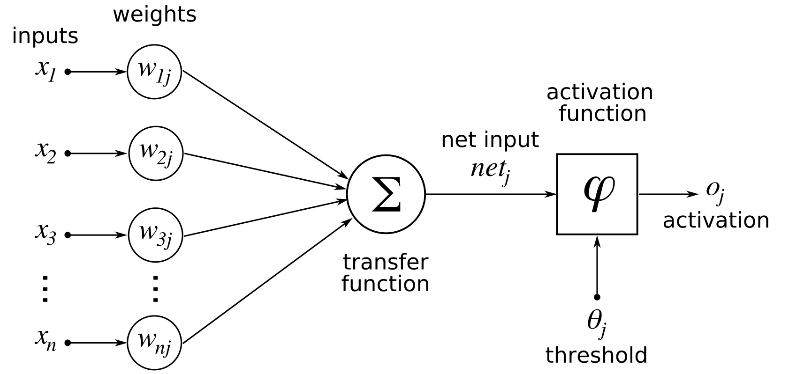

# Artificial Neural Network (ANN)
In this project, we will build perceptrons (also known as McCulloch–Pitts neuron, or M-P neuron) in Python, which is the simplest kind of artificial neural network, to implement equivalence and XOR logics.

## Introduction
**_Artificial neural networks (ANN)_** are information processing systems modeled after the human brain. Like the human brain, an ANN possesses a large number of highly interconnected processing elements called neurons, much like biological cells. Each artificial neuron has an internal state of its own called the activation. Each artificial neuron is connected to other artificial neurons via interconnection links specified by the weights, much like dendrites. The transmission of activation signal goes from the output of a neuron to the input of other neuron(s), whose biologically analogs take place from the axon of the output neuron, to the soma of the input neuron. The human brain learns by modifying the biological connections between neurons after being stimulated by chemical signals, and similarly the ANN learns by making adjustments to the synaptic connections that exist between the neurons.

The power of biological or artificial neural network come from 1) the vast number of neurons, 2) the multiple interconnectivity between them, and 3) the different classes of neurons available. In contrast with the more traditional methods of computing, ANNs can derive meanings from complicated or imprecise data, extract patterns and detect trends that are too complex to be noticed otherwise, and answer ‘what if’ questions. Due to these advantages, ANN are well-suited for tasks such as pattern-matching and classification, optimization function, approximation, vector quantization, and data clustering.

ANN and the human brain have a few major differences as follows. The speed for execution cycle time is a lot faster in a typical ANN than in a human brain. ANN also processes parallel operations simultaneously faster. The human brain has a lot more cells and complexity built into it. Fault tolerance is only handled in the human brain by its distributed nature, where the death of cells is not disastrous. Memory and control mechanisms are also handled differently between biological and artificial neurons.

ANN is specified by three entities: 1) synaptic interconnections, 2) learning rules for updating weights, 3) activation functions. Categorizing them in terms of synaptic interconnections, ANNs come in five main types of network architecture:
1. Single-layer feed-forward network
1. Multilayer feed-forward network
1. Single node with its own feedback
1. Single-layer recurrent network
1. Multilayer recurrent network

In this project we will only focus on the simplest topology, a single-layer perceptron. 

## Perceptron
A _**single-layer perceptron**_, also called McCulloch–Pitts neuron, or M-P neuron, is the simplest architecture of an artificial neural network. The term single-layer means that other than the input neurons and the output neuron, there is no hidden layer of neurons between them for computation.  

_**Architecture**_. The perceptron needed consists of four input neurons , one output neuron , and the interconnections between them are denoted by the weights  where  denotes pointing from input  to output. Like a biological neuron, the weights may be either excitatory (positive) or inhibitory (negative).

_**Activation function**_. In general, an activation function associated with a neuron transforms the net input to the desired output. There are many examples of activation functions, such as 
1. The identity function $f(x)=x$, used in the input layer.
1. The step functions, including 1) the binary step function $f(x)=1$ if $x \geq \theta$ and $f(x)=0$ if $x \leq \theta$, where $\theta$ is the threshold value, or 2) the bipolar step function $f(x)=1$ if $x \geq \theta$ and $f(x)=-1$ if $x \leq \theta$, both used in the output layer.
1. The ramp function $f(x)=0$ if $x < 0$, $f(x)=x$ if $0 \leq x \leq 1$, and $f(x)=1$ if $x > 1$.
1. The binary sigmoid function $f(x)=\frac{1}{1+e^{-x}}$ whose output ranges from $0$ to $1$.
1. The hyperbolic tangent function, $f(x)=\frac{1-e^{-2 x}}{1+e^{- 2x}}$ whose output ranges from $-1$ to $+1$. This is mathematically equivalent to the bipolar sigmoid function.

Note that the nonlinearity of the binary sigmoid function and the hyperbolic tangent function help bound the output. In our project, we will experiment with both of them.

## Project 1 - single-layer perceptron for equivalence relation
We will implement an equivalence logic on the perceptron as described in the following truth table, where the output is equal to the first input. See xxx notebook for details.

Training set: 
| Input 1    | Input 2    | Input 3    | Output    |
| ----------- | ----------- | ----------- | ----------- |
| 0      | 0      | 1      | 0      |
| 0      | 1      | 1      | 0      |
| 1      | 0      | 1      | 1      |
| 1      | 1      | 1      | 1      |

Test set:
| Input 1    | Input 2    | Input 3    | Output    |
| ----------- | ----------- | ----------- | ----------- |
| 0      | 0      | 0      | 0      |
| 0      | 1      | 0      | 0      |
| 1      | 0      | 0      | 1      |
| 1      | 1      | 0      | 1      |

### Architecture
A perceptron is a _**feed-forward**_ network, to be distinguished from a recurrent network, meaning that no neuron in the output layer is an input to a node in the same layer or in the preceding layer.
The architecture of a perceptron is shown in this diagram.

In our example, denote the inputs by $x_1, x_2, x_3$, denote the calculated output by $y$, and denote the target (correct) output by $t$. 
Denote the weight matrix by $W$, where the components $w_{ij}$ is the weight between the $i$-th neuron in the input layer and the $j$-th neuron in the output layer, so we will have $w_{11}, w_{21}, w_{31}$. 

### Forward-propagation
Forward-propagation is the process that calculates the output of a neuron. For our neuron $j$, the output $o_j$ is calculated as first taking a transfer function $\sum$ that transforms the weighted inputs to the net input $net_j$, then apply the activation function $\phi$ of the neuron which transfers the net input $z$ to the activation $\phi (z)$. Altogether, the output $o_j$ is
$$o_j = \phi(net_j) = \phi (\sum_i w_{ij} x_i)$$
We will experiment with two common activation functions:
1. In the case of a binary sigmoid function, $f(z)=\frac{1}{1+e^{-z}}$, and the derivative is $\frac{d\phi}{dz}(z)=\phi(z) (1 - \phi (z))$.
1. In the case of a hyperbolic tangent function, $f(x)=\tanh(x)=\frac{1-e^{-2 z}}{1+e^{- 2z}}$, and the derivative which will be useful later is $\frac{d\phi}{dz}(z)=\sech^2(x)=(\frac{2}{e^z+e^{-z}})^2$.

### Back-propagation
Back-propagation is an general algorithm that performs a backward pass to adjust the parameters of a neural network, aiming to minimize error. One commonly used algorithm to find the set of weights that minimizes the error is gradient descent. 

Gradient descent algorithm calculates the partial derivative $\frac{\partial E}{\partial w_{ij}}$ of the error $E$ with respect to a weight $w_{ij}$, and take a step in this direction as it causes the maximal decrease of the error. The size of the step is determined by the learning rate. Mathematically -

Using the square error as a loss, the discrepancy or error $E$ between the target output $t$ and the actual output $y$ is,
$$E = \frac{1}{2} (t-y)^2$$

* The partial derivative is calculated by _ 
   $$\frac{\partial E}{\partial w_{ij}}=\frac{\partial E}{\partial o_j} \frac{\partial o_j}{\partial \text{net}_j} \frac{\partial \text{net}_j}{\partial w_{ij}}$$

* sdf
* sdf

## Project 2 - two-layer perceptron for XOR relation

We will implement the XOR logic on the perceptron as described in the following truth table. See xxx notebook for details.

Training set: 
| Input 1    | Input 2    | Input 3    | Output    |
| ----------- | ----------- | ----------- | ----------- |
| 0      | 0      | 1      | 0      |
| 0      | 1      | 1      | 1      |
| 1      | 0      | 1      | 1      |
| 1      | 1      | 1      | 0      |

Test set:
| Input 1    | Input 2    | Input 3    | Output    |
| ----------- | ----------- | ----------- | ----------- |
| 0      | 0      | 0      | 0      |
| 0      | 1      | 0      | 1      |
| 1      | 0      | 0      | 1      |
| 1      | 1      | 0      | 0      |

Train it in batch mode with the four examples mentioned in our slides, and test it with the other four remaining cases. 
Does it work? If you observe any limitations, explain their cause. Does it work for the example provided in the slides involving the XOR function?

###############Juan 
## Transfer Function
Compare the performance of the tanh and sigmoid transfer functions in your code (do not forget to change their derivative when doing this, also in the validation process). Is one faster than the other? (use the command CALL CPU_TIME( ) to time your code at given intervals). Does one work better than the other for the test inputs? If so, why?

## Learning Rate 
Optimize the learning rate separately for these two transfer functions. Do this by plotting the error vs. training epoch, as in the example below. Describe your observations.

# Performance Analysis
* Does the performance (error vs. epoch, or error in validation set) improve if you expand the training set? (e.g., by adding one more case to it). 
If you scramble it? (stay at four training cases, but use other cases for training). 
Do not forget to update the dimensions of your matrices when adding or subtracting new cases to the training set.

* Once your code is built, test it for other patterns of your own that link inputs and outputs: in doing so, develop a feeling for the limitations of the single neuron perceptron.

OPTIONAL: attempt the two-layer perceptron able to describe the XOR relation
(see http://iamtrask.github.io/2015/07/12/basic-python-network/ for guidance).
