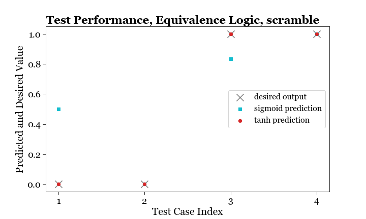

# Artificial Neural Network (ANN)
In this project, we will build 1) a single layer perceptron for equivalence logic, 2) a double layer perceptron for XOR logic, 3) a full neural network for categorizing MNIST dataset, in Python.

Acknowledgement: 1) 3Blue1Brown video, 2) http://neuralnetworksanddeeplearning.com/index.html

## Project 1 - single-layer perceptron for equivalence
* Data. We have three binary inputs and one binary output, whose relationship is described by Output = Input 1. 
   - The original training set contains 4 cases. The original test set contains 4 cases. 
   - The expanded training set contains 5 cases, one from the original test set. The reduced test set contains 3 cases, one taken out. 
   - The scrambled training set contains 4 cases, the scrambled test set contains 4 cases, but with an original training and an original test case swapped. 

Training set, original: 
| Input 1    | Input 2    | Input 3    | Output    |
| ----------- | ----------- | ----------- | ----------- |
| 0      | 0      | 1      | 0      |
| 0      | 1      | 1      | 0      |
| 1      | 0      | 1      | 1      |
| 1      | 1      | 1      | 1      |

Test set, original:
| Input 1    | Input 2    | Input 3    | Output    |
| ----------- | ----------- | ----------- | ----------- |
| 0      | 0      | 0      | 0      |
| 0      | 1      | 0      | 0      |
| 1      | 0      | 0      | 1      |
| 1      | 1      | 0      | 1      |

Training set, expand: 
| Input 1    | Input 2    | Input 3    | Output    |
| ----------- | ----------- | ----------- | ----------- |
| 0      | 0      | 1      | 0      |
| 0      | 1      | 1      | 0      |
| 1      | 0      | 1      | 1      |
| 1      | 1      | 1      | 1      |
| 0      | 0      | 0      | 0      |

Test set, expand:
| Input 1    | Input 2    | Input 3    | Output    |
| ----------- | ----------- | ----------- | ----------- |
| 0      | 1      | 0      | 0      |
| 1      | 0      | 0      | 1      |
| 1      | 1      | 0      | 1      |

Training set, scramble: 
| Input 1    | Input 2    | Input 3    | Output    |
| ----------- | ----------- | ----------- | ----------- |
| 0      | 0      | 1      | 0      |
| 0      | 1      | 1      | 0      |
| 1      | 0      | 1      | 1      |
| 1      | 0      | 0      | 1      |

Test set, scramble:
| Input 1    | Input 2    | Input 3    | Output    |
| ----------- | ----------- | ----------- | ----------- |
| 0      | 0      | 0      | 0      |
| 0      | 1      | 0      | 0      |
| 1      | 1      | 1      | 1      |
| 1      | 1      | 0      | 1      |

* Architecture. This neural network has only one single layer, with three input neurons, one output neuron, and a weight matrix of the shape $3 \times 1$. There is no hidden layer of neurons between the input and output. We do not include a bias term here to keep the architecture as simple as possible. 

* Transfer function. In general, a nonlinear transfer function is needed to bound the output. We experiment with both sigmoid function $\sigma(z)=\frac{1}{1+e^{-z}}$, and hyperbolic tangent tanh function $\tanh(z)=\frac{e^{z}-e^{-z}}{e^{z}+e^{-z}}$.

* Gradient descent. Back-propagation is an general algorithm that performs a backward pass to adjust the parameters of a neural network, aiming to minimize error, a.k.a. cost function. One commonly used algorithm to find the set of weights that minimizes the cost function is gradient descent. Gradient descent algorithm calculates the partial derivative of the cost function with respect to each weight, and take a step at the opposite direction for maximal decrease of the error. The size of the step is determined by the learning rate. Mathematically, let weights of layer $L$ be denoted by $w^{(L)}$, weighted sum by denoted by $z^{(L)}$. activation of the last layer neuron is $a^{(L)}$, 
   - Activation is given by,
$$a^{(L)} = \sigma(z^{(L)}) = \sigma(w^{(L)}a^{(L-1)}+b^{(L)})$$
   - Cost function for first training example, 
$$C_0= (a^{(L)}-y)^2$$
Partial derivative of this cost function w.r.t. each weight, 
$$\frac{\partial C_0}{\partial w^{(L)}} = \frac{\partial C_0}{\partial a^{(L)}} \frac{\partial a^{(L)}}{\partial z^{(L)}}  \frac{\partial z^{(L)}}{\partial w^{(L)}}$$
   - Term by term,
$$\frac{\partial C_0}{\partial a^{(L)}} = 2(a^{(L)}-y)$$
$$\frac{\partial a^{(L)}}{\partial z^{(L)}} =\sigma’(z^{(L)})$$
$$\frac{\partial z^{(L)}}{\partial w^{(L)}} =a^{(L-1)}$$
   - Altogether, 
$$\frac{\partial C_0}{\partial w^{(L)}} =2(a^{(L)}-y) \sigma’(z^{(L)}) a^{(L-1)}$$
   - Average cost function for all training example for batch training, 
$$\frac{\partial C}{\partial w^{(L)}} = \frac{1}{n} \sum_{k=0}^{n-1} \frac{\partial C_k}{\partial w^{(L)}}$$

* Learning rate. The plots below shows the training error as a function of the training epoch number, of the original, expanded, and scrambled training sets. Each plot compares sigmoid and tanh transfer functions, and various learning rates. This plot is used to pick the most optimized learning rate for each transfer function. This is in rough agreement with the paper. 

* Testing. Performance of test cases on optimized learning rate are plotted for original, expanded, and scrambled datasets. A few observations: 
   - tanh successfully predicts the test cases accurately and consistently, but sigmoid fails on the test cases even when the training error is low.
   - In particular, the large errors for sigmoid comes from the mathematical difference between sigmoid and tanh functions, even though their overall shapes look similar. Specifically, sigmoid ranges from $0$ to $1$ and $s(0)=0.5$, whereas tanh ranges from $-1$ to $1$ and $\tanh(0)=0$. 
   - This makes all the difference because given the same net input, say $0$, tanh predicts $0$ (which is correct) while sigmoid predicts $0.5$ (which is wrong). But the calculated gradient term is $0$ for both since it is a product of three terms including the input $0$. As a result, even though the sigmoid function sees a discrepancy between the predicted output $0.5$ and the desired output $0$, it does not have the suitable instrument to correct for the error in the gradient descent algorithm. One caveat is that sigmoid could adjust the weights so that the net input is very negative, but this approach biases other results. So, without including a bias term, sigmoid is not suitable to be the transfer function for the problem at hand where the input/ output function crosses the origin.

## Project 2 - two-layer perceptron for XOR relation

* Data. We have three binary inputs and one binary output, whose relationship is described by Output = (Input 1) XOR (Input 2), i.e. the Output is 1 if and only if exactly one of Input 1 and Input 2 is 1. The original, expanded, and scrambled datasets are partitioned as before.

Training set, original: 
| Input 1    | Input 2    | Input 3    | Output    |
| ----------- | ----------- | ----------- | ----------- |
| 0      | 0      | 1      | 0      |
| 0      | 1      | 1      | 1      |
| 1      | 0      | 1      | 1      |
| 1      | 1      | 1      | 0      |

Test set, original:
| Input 1    | Input 2    | Input 3    | Output    |
| ----------- | ----------- | ----------- | ----------- |
| 0      | 0      | 0      | 0      |
| 0      | 1      | 0      | 1      |
| 1      | 0      | 0      | 1      |
| 1      | 1      | 0      | 0      |

Training set, expand: 
| Input 1    | Input 2    | Input 3    | Output    |
| ----------- | ----------- | ----------- | ----------- |
| 0      | 0      | 1      | 0      |
| 0      | 1      | 1      | 1      |
| 1      | 0      | 1      | 1      |
| 1      | 1      | 1      | 0      |
| 0      | 0      | 0      | 0      |

Test set, expand:
| Input 1    | Input 2    | Input 3    | Output    |
| ----------- | ----------- | ----------- | ----------- |
| 0      | 1      | 0      | 1      |
| 1      | 0      | 0      | 1      |
| 1      | 1      | 0      | 0      |

Training set, scramble: 
| Input 1    | Input 2    | Input 3    | Output    |
| ----------- | ----------- | ----------- | ----------- |
| 0      | 0      | 1      | 0      |
| 0      | 1      | 1      | 0      |
| 1      | 0      | 1      | 1      |
| 1      | 0      | 0      | 1      |

Test set, scramble:
| Input 1    | Input 2    | Input 3    | Output    |
| ----------- | ----------- | ----------- | ----------- |
| 0      | 0      | 0      | 0      |
| 0      | 1      | 0      | 1      |
| 1      | 1      | 1      | 0      |
| 1      | 1      | 0      | 0      |

* Motivation. A single-layer perceptron is not sufficient for describing the XOR relationship. This is because the weighted sum of the two inputs is linear and monotonic with the inputs, and the two transfer functions to choose from are also monotonic functions, this means that the output cannot be low for 00, high for 01 or 10, and low again for 11. This necessitates a more complicated two-layer perceptron. 

* Feasibility. A network of perceptrons is a feasible choice for implementing XOR logic, a.k.a., bitwise sum logic. In fact, we can use networks of perceptrons to compute any logical function. This follows from the fact that NAND gate is a universal gate for computation, meaning that any digital logic can be represented as composites of NAND gates. In particular, the XOR logic $x_1 \oplus x_2$ can be rewritten as $(x_1 \oplus x_2) \oplus (x_1 \oplus x_2)$. A NAND gate can be implemented as a perceptron with two inputs $x_1, x_2$, with weights $w_1 = -2, w_2 = -2$ respectively, and bias $b = 3$. Our network of perceptron allows even more flexibility than just an assortment of strictly NAND gates, and we will show that the XOR logic can be implemented as a simple two-layer perceptron, i.e. a hidden layer of neurons between the input layer and the output layer.

* Gradient descent. The backpropagation step in the gradient descent algorithm is nothing but applying chain rule in multi-variable calculus. The chain rule for a two-layer perceptron is slightly more complicated than for a single-layer perceptron. Using linear algebra notation, let $x$ be the input vector of dimension $(3, 4)$ representing three inputs $x_1, x_2, x_3$, for a total of $4$ training data. Let $w_1$ be the weight matrix connecting the input layer and the hidden layer, of dimension $(3, 4)$, where $4$ represents the number of neurons in the hidden layer, the choice of which is more art than science. Let $w_2$ be the weight matrix connecting the hidden layer and the hidden layer, of dimension $(4, 1)$. For our network, we will restrict the biases to be $0$. Let $a_1$ denote the activation of the hidden layer neuron, which is of dimension $4$. Let $a_2$ denote the output, which is equivalent to the activation of the second layer neuron, of dimension $1$. Thus, 

   - Net input of first layer: $z_1(x) = w_1 \cdot x +b_1$
   - Activation of first layer: $a_1(x)=\sigma (w_1 \cdot x +b_1)$
   - Net input of second layer: $z_2(x) = w_2 \cdot z_1(x) + b_2$
   - Activation of second layer: $a_2(x) = \sigma (w_2 \cdot z_2(x) + b_2)$
   - Cost function: $C(w,b) = \frac{1}{2n} \sum_x |y(x)-a(x)|^2$
   - Gradient descent step: $\Delta w_{1,ij} = -\eta \frac{\partial C}{\partial w_{1,ij}}, \Delta w_{2,ij} = -\eta \frac{\partial C}{\partial w_{2,ij}}$
   - For second layer weights: $\frac{\partial C}{\partial w_{2,ij}} = \frac{1}{n} \sum_x |y(x)-a(x)| \cdot \sigma' (w_2 \cdot \sigma (w_1 \cdot x +b_1) + b_2) \cdot \sigma (w_1 \cdot x +b_1)$
   - For first layer weights: $\frac{\partial C}{\partial w_{1,ij}} = \frac{1}{n} \sum_x |y(x)-a(x)| \cdot \sigma' (w_2 \cdot \sigma (w_1 \cdot x +b_1) + b_2) \cdot w_2 \cdot \sigma' (w_1 \cdot x +b_1) \cdot x$

* Learning rate. The plots below shows the training error as a function of the training epoch number, of the original, expanded, and scrambled training sets. Each plot compares sigmoid and tanh transfer functions, and various learning rates. This plot is used to pick the most optimized learning rate for each transfer function. 

* Testing. Performance of test cases on optimized learning rate are plotted for original, expanded, and scrambled XOR datasets. A few observations: 
   - The training error for a two-layer neural network has more complicated features than that of a single-layer neural network, for example, the emergence of oscillatory behavior of the training error.
   - Even though the training error is eventually low, the prediction for test data is a lot less accurate in comparison. Out of all the test dataset, $\tanh$ prediction on the original XOR test set is the most accurate.

## Project 3 - neural network for MNIST data

* Data. The MNIST (images of handwritten digit) dataset are partitioned into 50000 training images, and 10000 test images. 

* Architecture. Since the input consists of $28 \times 28$ pixel values ranging from $0$ to $1$, to be classified into digits $0-9$, the input layer has 784 neurons, and the output layer has 10 neurons. The code is designed for creating a neural network with any arbitrary number of hidden layers. We will experiment with 1) 30 neurons in the hidden layer, 2) 100 neurons in the hidden layer, and 3) no hidden layer at all. 

* Code structure. http://neuralnetworksanddeeplearning.com/index.html. The centerpiece of the code is a Network class, representing a neural network with customizable number of layers, each with customizable number of neurons. The weights and biases are then initialized accordingly as arrays of matrices. One method of the class is feedforward, where activations of latter layers are propagated from the input while applying sigmoid transformation at each step. Another method is stochastic gradient descent, which invokes a backpropagation algorithm. This backpropagation algorithm is the heart and soul of the neural network, since it is how the neural network learns. Mathematically, the amount of change to update the weights and biases at each learning step, is the negative of the learning rate and the gradient vector. In the algorithm, the insight to make the computation of gradients easier is to realize that other than the last layer’s weights and biases, the gradient of any previous layer is just the gradient of the latter neighboring layer, multiplied by a sigmoid derivative term, and an optional previous activation (in the case of weights, for biases this term is dropped). This significantly simplifies the complexity of the code, and makes the code structure a lot more organized. Other methods of the Network class include evaluating the success rate of the test set.

* Stochastic gradient descent (SGD). When the training dataset is large and computationally expensive, going over all datapoints to compute one gradient descent step is not efficient in time. To speed things up, the training data is split into small batches, (say) each made of 10 images. And a backpropagation step is already done just based on these small batch of training data, and makes edits to the weights and biases of the neural network, without going through the other training data. Once all the training data has been looped over, which takes 5000 iterations in our case, this completes a training epoch. If gradient descent algorithm is analogous to a careful mathematician walking down a hill, the SGD algorithm is analogous to a drunk person walking down a hill, trading speed over accuracy.

* Test performance. The plot below shows the performance of neural networks of different architectures in identifying the handwritten digits, specifically 1) a neural network with 30 neurons in the hidden layer, 2) a neural network with 100 neurons in the hidden layer, and 3) a neural network with no hidden layer at all. Findings show that having a hidden layer helps a lot with test accuracy, and having more neurons in the hidden layer eventually helps with the test accuracy after the model has been properly trained with enough training epochs.

