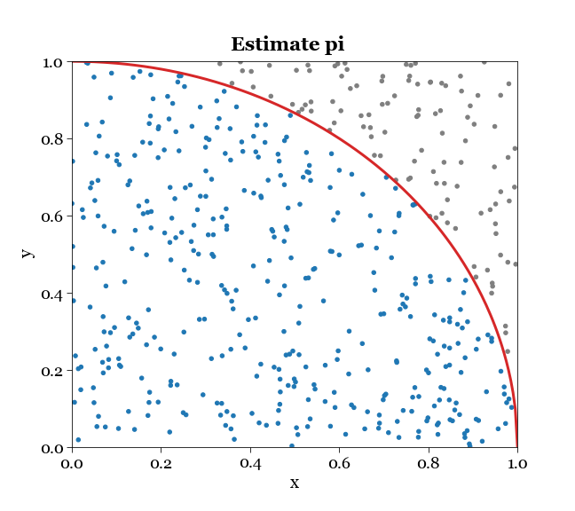
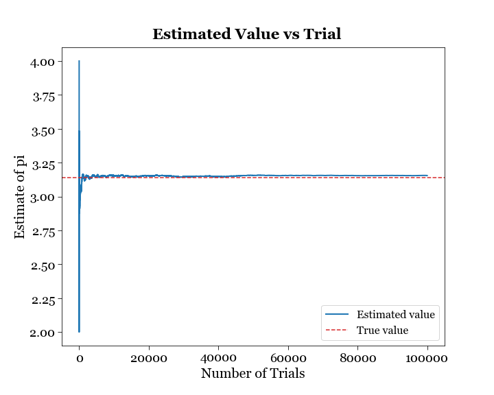
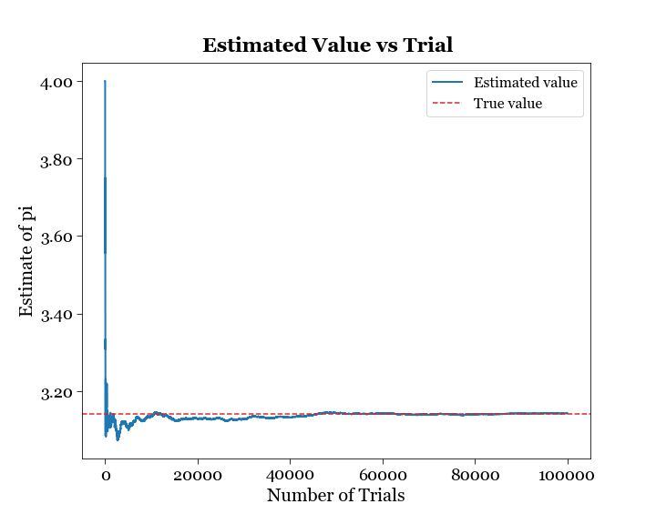
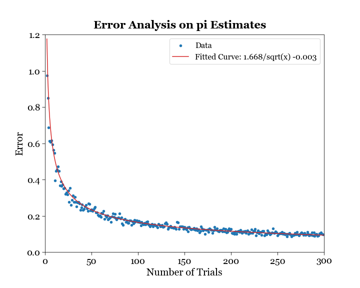

# Monte Carlo

## Estimate $\pi$
In this project, we will use Monte Carlo technique to calculate the value of $\pi$ using the hit-and-miss method. 

Let $x, y$ be two uniformly distributed random numbers ranging from $0$ to $1$. Let $A$ be the area bounded by the quarter arc of a unit circle. For the top right quadrant, throw "darts" with horizontal and vertical positions $x$ and $y$ respectively. Naturally, the number of darts landing within $A$ divided by the number of darts thrown equals to 
$$\frac{\pi r^2 /4}{r^2}  =\frac{\pi}{4}$$

## Background 
In the original paper, “The Monte Carlo Method” by Metropolis and Ulam, the Monte Carlo method is presented as a statistical approach to the study of (integro-) differential equations. There has been a sharp distinction between two different mathematical methods of treating physical phenomena - classical mechanics for solving problems involving only a few particles and ordinary differential equations, and statistical mechanics for analyzing ensemble behavior for systems involving very many particles. However, when a physical system involves an intermediate situation, neither of the approaches is sufficient, practical or realistic. Examples of such problems include, 1) combinatorial analysis on the probability of a success outcome of solitaire, 2) evaluating the volume of a region in a high-dimensional space, 3) the study of cosmic rays involving many particles and various nuclear events. 

Monte Carlo techniques:
* Sampling the uniform distribution. Monte Carlo sampling or integration techniques assume a “random number generator” which generates uniform statistically independent values on the half open interval $[0,1)$.
* Inverse transform method. Supposed we want to sample $x$ from the probability density function $f(x)$, with a cumulative distribution function $F(x)$. If $a$ is chosen with probability $f(a)$, then the integrated probability from $-\inf$ to point $a$, is itself a uniform random variable on $[0,1)$. This is because equal increments of $F(x)$ represents equal intervals of probabilities, which by definition occurs with equal probabilities. Suppose $u$ is the random variable we have sampled from the uniform distribution. Set $u=F(x)$. Then the random variable we want to sample, $x$, is given by $x=F^{-1}(u)$. The drawback of this method is that it only works with probability density functions that are integrable, then invertible. 
* Acceptance-rejection method (Von Neumann). This method works in the case where an analytical form for $F(x)$ is unknown or too complex to work with. Suppose that $f(x)$ is known and we can enclose it entirely inside a shape which is $C$ times an easily generated distribution $h(x)$, usually a uniform distribution. To generate $f(x)$, first generate a candidate $x$ according to $h(x)$. Then generate $u$ and test is $u C h(x) \leq f(x)$, if so accept $x$, and if not reject $x$ and try again. 

There are specific Monte Carlo algorithms for various distributions:
1. Exponential decay
1. Sine and cosine of random angle
1. Gaussian distribution
1. $\Chi^2(n)$ distribution 
1. Gamma distribution
1. Binomial distribution
1. Poisson distribution 
1. Student’s t distribution 

## Statistical Analysis
The plot below shows how the estimate of $\pi$ converges to the true value, as the number of trial increases up to $100000$. 

The plot below is of a similar setup, except that I changed the inequality for accepting the hit counts from strictly less than, to less than or equal to, so points on the boundary of the arc are included towards the calculation of $\pi$, therefore elevating the estimate.

## Error Analysis
To further investigate how fast the estimate converges to the true value, I varied the number of trials, $N$, from $2$ to $300$, and took $100$ samples of estimates for each value of $N$. The standard deviation in the estimate of $\pi$ for each batch of samples is calculated. This is the standard deviation of the sapling distribution of the mean, $\sigma_m$, also known as the standard error. As shown in the plot below, the standard error scales as $1/\sqrt{N}$.

This comes from a general statistical fact and is not specific to the Monte Carlo technique, as follows. Suppose the population variance is $\sigma$ which is fixed but unknown to us, and the sample size is $N$. For $N$ numbers sampled from a population with variance $\sigma^2$, the variance of the sum is $N \sigma^2$. Since the mean is $1/N$ times the sum, the variance of the mean is then $\sigma^2/N$, thus the standard deviation of the mean is $\sigma/\sqrt{N}$.

