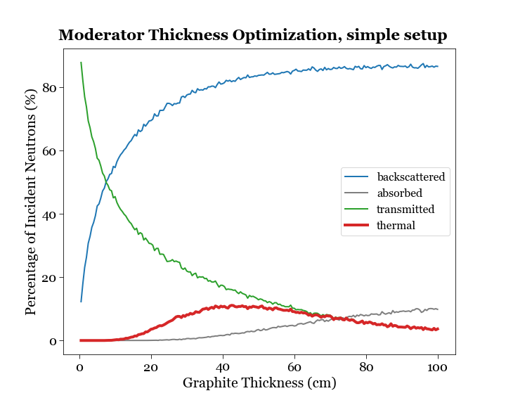

# Chicago-Pile No. 1 (CP-1) Simulation
## Background
It’s important to establish some background physics for understanding how a nuclear reactor works.
* Nuclear reaction. A nuclear reaction involves input and output reactants, and obeys the conservation of total mass-energy (i.e. relativistic mass-energy + kinetic energy). The Q-value of a reaction describes if a reaction liberates energy or demands a threshold energy to cause it to happen,
$$Q=\sum KE_{output} - \sum KE_{input} = \left(\sum m_{input} - \sum m_{output}\right) c^2$$
* Fission of Uranium. Neutron-induced uranium is the process underlying many nuclear bombs and reactors, one way of which is the extremely energetic splitting of a $^{235}U$ nucleus into barium and krypton accompanied by the release of three neutrons. The fission energy latent in a small amount of the reactants is enormous. 
* Nuclear reactor. Building a nuclear reactor involves sustaining a neutron-moderated chain reaction, where on average at least one neutron will be liberated per fission event. This is denoted by $k$. 
* Energy spectrum of fission neutrons. When nuclei fission, and typically emit two or three neutrons, these secondary neutrons exhibit a spectrum of kinetic energies, which can be expressed as 
$$P(E)dE \sim \sqrt{E}\exp (-E/\alpha)dE$$
where $\alpha$ is some fitting parameter, and $\alpha \sim 1.29$ MeV for $^{235}U$.
* Fission barrier. Any nucleus (e.g. an isotope of Uranium) can be induced to fission under neutron bombardment, but the difficulty of which is specified by a characteristic fission barrier. The fission barrier for $^{236}U$ is exceeded by the Q-value for the relevant reaction, whereas the fission barrier for  $^{239}U$ is higher than the Q-value for the relevant reaction, and this makes all the difference why  $^{235}U$ is a “fissile” nuclide, while  $^{238}U$ is “fissionable”.
* Critical mass. The critical mass is the amount of fissile material needed for a workable nuclear weapon. If the sample of fissile material is too small, the escape probability is high, hence the reason why there is a minimum size of material needed for all nucleus inside the material to be fissioned. 
* Mean Free Path. Understanding Mean Free Path (MFP) for neutron travel is important for calculating reactor criticality. Suppose we have a thin slab of material of thickness $s$, cross-sectional area $\Sigma$, bombarded by neutrons at a rate of $R_0$ neutrons per unit area per unit time, then the incident neutron flux is per unit time is given by $R_0 \Sigma$.
   - On the nuclei side, let $\rho$ be the density of material, $N_A$ be Avogadro’s number, $A$ be the atomic weight of the material, $\sigma$ be the cross-section for the reaction (representing in unit of area how reactive each nucleus presents itself to the incoming neutrons). Then the number density of nuclei in the material is $n=\frac{\rho N_A}{A}$.
   - The fraction of surface area available for reactions to occur is the total number of nuclei (i.e. volume $\Sigma s$ times density $n$) times the fraction of surface area for the particular reaction to occur $\Sigma sn(\sigma/\Sigma) =sn\sigma$.
   - Thus, the rate of reactions $R$ is the product of incident neutron flux times the fraction of surface area available for reactions, $R=(R_0 \Sigma)(sn\sigma)$.
   - For an individual incident neutron, the probability of it participating in a reaction is $P_{react} = sn \sigma$, and the probability of it escaping the slab is $P_{escape} = 1- P_{react} = 1-sn \sigma$.
   - For a block of material of thickness $L$, calculus can be used to figure out the probability of an incident neutron escaping the whole block, as follows. The number of slabs is therefore $L/s$. The probability of an incident neutron escaping the whole block is the product of it escaping each slab, $P_{escape}=(1-sn\sigma)^{L/s}$.
   - Since each slab can be made infinitesimally thin, define $z=-sn\sigma$, then 
   $$P_{escape}=(1+z)^{\sigma nL/z} = [(1+z)^{1/z}]^{-\sigma nL} \rightarrow e^{-\sigma nL}$$
   $$P_{react}=1-P_{escape} = 1 - e^{-\sigma nL}$$
   - A useful parameter is the mean free path or characteristic length for the reaction, which is defined as the average distance a neutron will travel before undergoing a reaction. This can be calculated as averaging the number of neutrons $dN_x$ that penetrate to distance $x$ and $x+dx$ over all possible travel distances. Assume $N_0$ neutrons are incident at the $x=0$ surface, then the number of neutrons consumed $dN_x$ between $x$ and $x+dx$ is
   $$dN_x = N_0 e^{-\sigma nx}(\sigma ndx)$$
   - The mean free path $\lambda_s$ is,
   $$\lambda_s = \frac{1}{N_{react}}\int_0^L xdN_x =\frac{1}{N_0 (1-e^{-\sigma nL})} \int_0^L (N_0\sigma n)x e^{-\sigma nx}dx =\frac{1}{\sigma n} \frac{1-e^{\sigma nL}(1+\sigma nL)}{1-e^{\sigma nL}}$$
   - For thick slab, $\sigma nL$ is large, then 
   $$\lambda_s \rightarrow \frac{1}{\sigma n}$$
* Slow neutron. Fermi discovered accidentally that if the bombarding neutrons were caused to be slowed (“moderated”) before hitting the target element, the rate of the induced radioactivities could be drastically increased. When a nucleus is struck by a neutron, one of three things will in general happen: (1) The nucleus may fission $(f)$; (2) The nucleus may capture the neutron without fissioning $(c)$; or (3) The neutron may scatter from the nucleus. For example, the fissility parameter for fast neuron with $^{235}U$ is $1.235$, whereas the fissility parameter for slow neuron with $^{235}U$ is $584.4$. Note that even though slow neutrons are extremely useful for maximizing criticality for reactors, they are not applicable for nuclear bombs as the key metric there is the energy released, which goes as the inverse square of the reaction time.
* Reactor criticality. Reactor criticality factor, denoted by $k$, is the key figure of merit in whether ($k \geq 1$) or not ($k < 1$) a reactor can achieve a self-sustaining chain reaction. An ideal reactor has control mechanisms in place to maintain $k=1$. Criticality is achieved when the number of neutrons inside a reactor increases with time. For a mixture of $^{235}U$ and $^{238}U$ isotopes in our reactor, let $F$ denote the fractional abundance of $^{235}U$, the total cross section for each isotope is
   $$\sigma_5 = \sigma_{f5} + \sigma_{c5}, \ \sigma_8 = \sigma_{f8} + \sigma_{c8}$$
   $$\sigma_{total} = F\sigma_{5} + (1-F)\sigma_{8}$$
   - If fission of a $^{235}U$ nucleus liberates on average $\nu_5$ secondary neutrons, and fission of a $^{238}U$ nucleus liberates on average $\nu_8$ secondary neutrons, then the total number of secondary neutrons created by one initial neutron is
   $$k = \frac{ F \nu_5 \sigma_{f5} + (1-F)\nu_8 \sigma_{f8}}{\sigma_{total}}$$
   - One will find that for fast neutrons in natural uranium, $k_{fast} = 0.283$, and since $k_{fast} < 1$, a self-sustaining chain reaction using unmoderated neutrons with natural uranium is impossible. However, for slow neutrons in natural uranium, $k_{slow} = 1.337$, and since $k_{slow} > 1$, a self-sustaining reaction with moderated neutrons and natural uranium is possible. 
* Neutron thermalization. Fermi’s CP-1 reactor used graphite as a moderator to slow neutrons emitted from fissioning $^{235}U$ nuclei to so-called “thermal” speeds to take advantage of the large fission cross-section of that isotope for neutrons of such energy. Graphite is chosen for small capture cross-section for neutrons. “Thermal speed” is the Maxwellian most probable velocity for a neutron at approximately room temperature,
   $$v_{mp} = \sqrt{\frac{2k_B T}{m}}=2217\ \text{m/s} \sim 0.025 \ \text{eV}$$
   - In comparison, the secondary neutrons emerged from a fissioned nucleus, have a typical energy of $\sim 2$ MeV. These secondary neutrons from then on undergo many scattering events, until becoming thermalized. In order to determine the geometry for the graphite moderator to ensure the secondary neutrons be suitably thermalized, we need to first calculate what fraction of energy is lost per scattering event. For a head-on collision between a neutron of mass $m_n$ with initial speed $v_0$ and a Carbon atom of mass $m_C$, the neutron will recoil with speed $v$ given by 
   $$v=|\frac{m_n-m_C}{m_n+m_C}| v_0$$
   - Since $m_C \sim 12 m_n$, the recoil speed is $11/13$ of the original speed, so the recoil kinetic energy is $(11/13)^2$ of the original kinetic energy. Therefore, the number of collisions required to reduce a neutron emitted from fission event to a thermal neutron is then
   $$N=\frac{\log(E/E_0)}{2\log(11/13)}$$
   which is calculated to be about $54$ in our case if all collisions are head-on.
   - For the graphite density of $\rho=1.62\ \text{g/cm}^3$, and elastic scattering cross-section of $^{12}C$ of $4.746\ \text{bn}$, the mean free path is calculated to be 
   $$\lambda_s=  \frac{1}{\sigma n} = 2.6 \ \text{cm}$$
   - Quoting statistical mechanics result of a particle taking $N$ random steps of length $\lambda_s$, the average displacement from the starting point will be $\sqrt{N} \lambda \sim 19 \ \text{cm}$.

In this project I will numerically simulate and optimize the geometry of the graphite moderator, and compare the simulation results to literature. Since the potential for random variables is present, I will use Monte Carlo simulation to assign multiple values to probabilistic variables to achieve multiple results and then averaging the results to obtain an estimate. What makes the Monte Carlo method powerful is the ability to examine a number of random variables and averages the results, which encompasses more information than starting out with an average. 

## Simulation flowchart
The program tracks the neutrons in the following manner - 
1. The incident neutron starts at 3D coordinates $(x, y,z)=(0,0,0)$.
1. The incoming neutron energy is sampled by the `get_fission_neutron_energy` routine.
1. The randomized entry angle is determined by the `get_entry_angle` routine. 
1. The unit velocity vector is built by the `get_velocity_vector` routine.
1. The distance to next interaction (including multiple cross-sections) is calculated by the `get_free_prop_distance` routine. This is determined with the help of another routine `get_cross_sections` that estimates the cross sections for absorption and elastic scattering based on the neutron energy.
1. The new position is calculated using the information about the velocity vector and distance till the next interaction by the `get_new_position` routine. 
1. At the interaction site, there can be different processes happening: a) backscattered, b) absorbed, c) transmitted, d) transmitted with energies below $\sim 500$ eV. 
   * If the neutron is backscattered, $z<0$, it is added to the respective counter. Proceed to the next neutron.
   * If the neutron is transmitted, $z>D$, it is added to the respective counters, depending on if it is “thermalized” or not. Proceed to the next neutron.
   * If the neutron is absorbed, it is added to the respective counter. Proceed to the next neutron.
   * If none of these happens, then it is most probably an elastic scattering within the graphite block. The energy loss and scattering angle are calculated by the `get_energy_loss` and `get_scatter_angle` routines. Then, a new trajectory is calculated by the `get_euler_angles` routine. Loop back to the `get_cross_sections` routine to proceed with the next interaction.
1. Elastic scattering calculation. Suppose a neutron with mass $m_n$ at speed $v_n$ and kinetic energy $T_0$ is incident upon a carbon atom with mass $M$, and the neutron is scattered off at an angle $\psi$ about the $z$ axis at speed $v’$ with kinetic energy $T’$, and the carbon atom is scattered off at an angle $\xi$ about the $z$ axis at speed $v$ with kinetic energy $T$. By conversation of energy $T_0 = T’ + T$ or $m_n v_n^2 = m_n v’^2 + M v^2$, and conservation of momentum $m_n v_n = m_n v’ \cos \psi + M v \cos \xi$, therefore we get 
$$\frac{T}{T_0} = 4\frac{m_n M}{(m_n + M)^2} \cos^2\xi = 2\frac{m_n M}{(m_n + M)^2} (1- \cos \psi)$$
$$\frac{T'}{T_0} = \frac{m_n^2}{(m_n + M)^2} \left[\cos \psi \pm \sqrt{\left(\frac{M}{m_n}\right)^2-\sin^2\psi}\right]^2$$

## Simple Infinite Block Setup
A Monte Carlo simulation that tracks neutrons emitted from a point-like fission source a graphite slab (infinite along $x$ and $y$) of thickness varied from $1$ cm to $100$ cm, is included in the `./code/CP-1_simulation` file. Below plots the percentage of neutrons a) backscattered, b) absorbed, c) transmitted, d) transmitted and thermalized (the desired case).

The optimal value of $D$ is therefore chosen to be $40$ cm, which is a bit higher than the literature value of $21$ cm documented in the book “Physics of the Manhattan Project”. For this choice of $D$, the exiting spectrum of the moderated neutrons is plotted and compared with the emission spectrum of incident neutrons, where the scaling between the two are adjusted for visualization purposes only.

## More Realistic Geometry
Another Monte Carlo simulation is done for the geometry that the uranium fuel sphere is at the center of a cubic graphite block of length $D$. In this case there is no such thing as backscattering. And the new optical value of $D$ is longer, about $100$ cm. 

For this choice of $D$, the exiting spectrum of the moderated neutrons is plotted and compared with the emission spectrum of incident neutrons, where the scaling between the two are adjusted for visualization purposes only.

## More Realistic Cross-section
To capture the fact that exiting neutrons with different energies have different fission cross sections, and the goal is to maximize the total fission cross section, I read in the file `u235fission.in` which associates neutron energy and $^{235}U$ cross-section, and linearly interpolate cross-section values that don’t have matched energy. 

Below is a plot of an averaged fission cross-section out of all neutrons exiting the graphite block. Given the more careful calculation, the optimized graphite thickness is about $100$ cm. 

