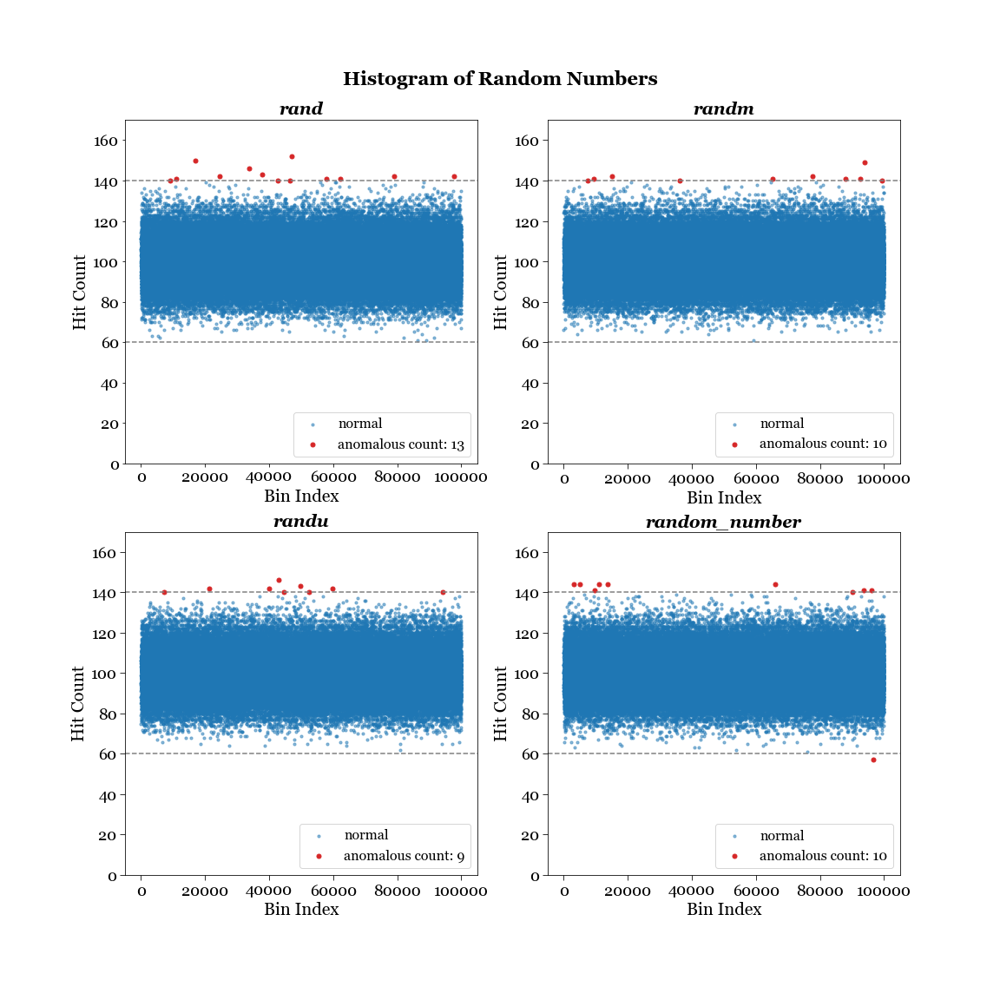
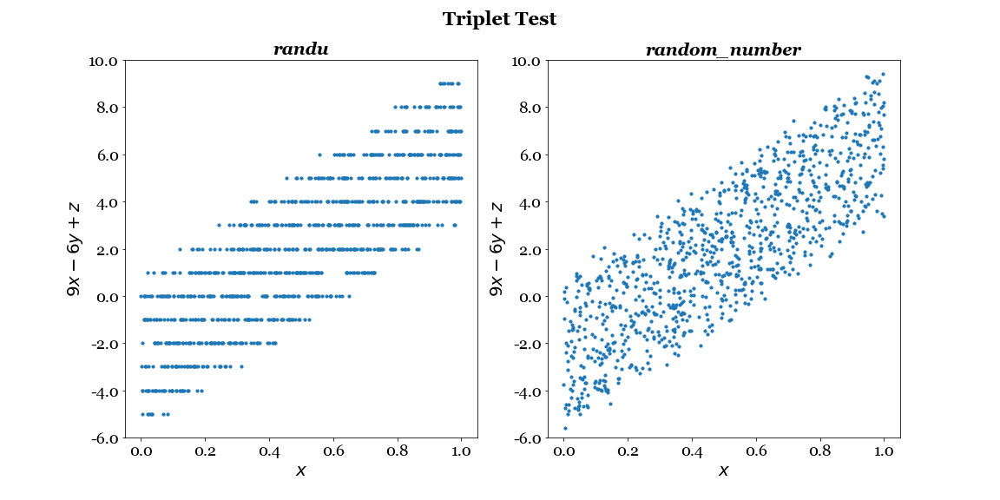
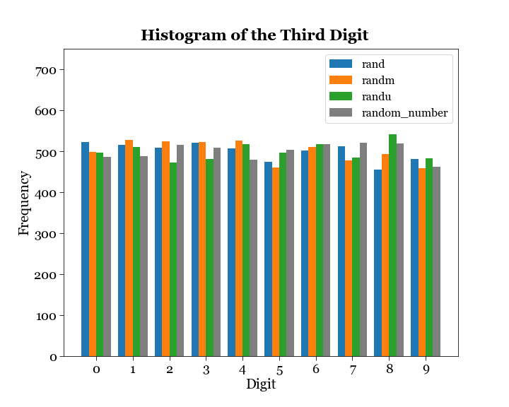

# Random Number Generator

## Introduction
A Random Number Generator (RNG) is a computational or physical process that generates a sequence of numbers with no discernible pattern and appearing random. A random number is one generated by a process, whose outcome is unpredictable and cannot be subsequentially reliably reproduced. In other words, knowing previous random numbers ("deviates") provides no extra information about the value of the subsequent random numbers. Random number generators are widely used in computer science, statistics, numerical simulation, and cryptography. 

There are two main types of RNGs - true random number generators (TRNGs) and pseudorandom number generators (PRNGs). 

TRNGs generate random numbers from unpredictable physical processes. Quantum physics, which is inherently unpredictable, is a natural ideal candidate for generating truly random numbers. For example, [this experiment](https://arxiv.org/pdf/1107.4438) transforms vacuum field contained in the radio-frequency sidebands of a single-mode laser into a string of random numbers. [This whitepaper](https://canvas.uchicago.edu/courses/52540/files/9986928?wrap=1) outlines another scheme of generating true random numbers by encoding '0' and '1' based on the transmission port of single-photons upon a semi-transparent mirror. 

PRNGs uses computer algorithms and an initial value (seed) to generate random numbers that appear random but are, in fact, deterministic. The same seed would produce the same sequence of numbers. PRNGs are still suitable and appropriate for many applications, especially when the convenience of generating the pseudorandom numbers outweigh the cost of producing cryptography-grade random numbers. However, random number generators can have pretty poor quality, even if they might look random at first sight. [This document](http://physics.ucsc.edu/~peter/115/randu.pdf) uncovers the unwanted underlying structure underneath the random generator routine `randu`, where all triplets of points generated by `randu` lie on one of the 15 planes $9x-6y+z=m$, revealing that the routine fails badly in the correlation test.

In this project, I study xx different PRNGs: `rnd`, `randm`, `randu`, `random_number`. For each RNG, I will:
- explain how the random number is generated
- test and visualize the performance of the random numbers generated
- conclude about the respective qualities of these RNGs

## Mechanisms of the RNGs
Several of the RNGs uses an algorithm called linear congruential generator (LCG), which yields a sequence of pseudo-randomized numbers calculated with a discontinuous piecewise linear equation. The generator is defined by the recurrence relation $$X_{n+1} =  (a X_n + c) \mod m$$, where $X$ is the sequence of pseudorandom values, and $m$ is the modulus, $a$ is the multiplier, $c$ is the increment, $X_0$ is the seed or start value. LCGs are easy to implement and computationally efficient but have limitations in terms of the quality of randomness they produce. They are often used in applications where cryptographic-level randomness is not required, such as simple simulations and games. 

1. `rand`, with source code in `rand.f`, is an implicit function in FORTRAN, where the seed can be set by calling `srand(77777)`.  The program overall generates 1000 such random numbers and save in a file `rand.in`.
1. `randm`, with source code in `randm.f`, is a linear congruential generator with $m = 2^31$, $a = 6539$, and $c=0$ which makes it a multiplicative linear congruential generator (MCG). We start with a seed value $X_0$. The subroutine then scales the numbers back to $0$ to $1$ by multiplying the resultant integer by $2^{-31}$. The program overall generates 1000 such random numbers and save in a file `rand.in`.
1. `randu`, with source code in `randu.f` as copied from [this file](http://physics.ucsc.edu/~peter/115/randu.pdf) that illustrates its pitfalls, is another linear congruential generator from IBM with $m = 2^31$, $a = 65539$, and $c=0$. We start with a seed value $X_0$. Even though the moments of the sample of numbers generated look quite good, `randu` fails badly with regards to the numbers being free of correlations with each other, as we will see later. 
1. `random_number`, with source code in `random_number.f`, is an implicit function in FORTRAN with documentation in [this link](https://gcc.gnu.org/onlinedocs/gfortran/RANDOM_005fNUMBER.html), implements the xoshiro256** pseudorandom number generator (PRNG). This generator has a period of $2^{256} - 1$.

## Performance Testing of the RNGs
I will test the RNGs in a few ways with various degree of statistical rigor: 
### 1. Histogram Test
We sort the random numbers in histogram bins and check for statistically significant deviations from the mean (vary the seed, and the numerical precision of the variable holding the random number). Note that we are not measuring the mean and the standard deviation of the random numbers directly, but rather the count of them in each bin. In `rnd_test.f`, we set the number of bins to be $100000$ by the variable `PRECIS`, which determines the precision of the random variable to be 5 digits after the decimal point. After initializing the bins, we then call each RNG algorithm under test $100 \times 100000$ times. So we expect that on average each bin has $\mu = 100$ count of numbers, and the standard error of the count is $\sigma = \sqrt{\mu} = 10$. We set the threshold of our confidence interval to be $4$, meaning that a bin is flagged as anomalous if the count of random numbers contained it in is at least $4\sigma = 40$ away from the mean. `rndtest_[test_name].out1` stores information of all bins - bin number, hits in bin, standard error (which is a constant). `rndtest_[test_name].out2` stores information about the anomaly bins - bin number, hits in bin, and numbers of sigma away from the mean.

This collection of histogram plots display hit counts for the four RNGs with the same seed value of $X_0 = 777$, with anomalous data flagged in red and enlarged for illustration purposes. By central limit theorem, we expect that the distribution of hit counts in each histogram bin approximates a normal distribution, as our sample size of $100000$ bins is sufficient for the CLT to hold. Theoretically, for a normal distribution curve, we expect $6.334E-5$ fraction of data outside $\pm 4\sigma$, or $6.3$ data points for our sample size. So all the RNG algorithms produce more anomalous bins than expected. The analysis code is contained in `RNG_analysis.ipynb`.

<picture>
 <source media="(prefers-color-scheme: dark)" srcset="RNG_histogram_flagged_plots_Tableau.png">
 <source media="(prefers-color-scheme: light)" srcset="RNG_histogram_flagged_plots_Tableau.png">
 
</picture>

### 2. Triplet Correlation Test
Random number generators are the basic tools of stochastic modeling. Bad random number generators may ruin a simulation. Monte Carlo results are misleading when correlations hidden in the random numbers and in the simulated system interfere constructively. In [this paper](https://citeseerx.ist.psu.edu/document?repid=rep1&type=pdf&doi=dd766094d94bf8af5402a38d0bedb42ad0927d71), the author investigated the LCG `randu` and found that even though the correlation between consecutive non-overlapping pairs of numbers $(x_{2n}, x_{2n+1})$ looks normal, the triples $(x_{3n}, x_{3n+1}, x_{3n+2})$ are extremely correlated and happen to lie on only fifteen planes, producing a catastrophic lattice. I will reproduce this result by setting a seed value of $X_0 = 314159$ will reproduce the integer lines of the triplets $9x-6y+z$. The analysis code is contained in `RNG_analysis.ipynb`.

<picture>
 <source media="(prefers-color-scheme: dark)" srcset="triplet_test_comparison.png">
 <source media="(prefers-color-scheme: light)" srcset="triplet_test_comparison.png">
 
</picture>

### 3. Digit Frequency Test
An ideal random number generator would produce a uniform distribution of each of the 10 digits at all decimal places. Here we are plotting a bar chart of the third digit for all four random number generators, `rand`, `randm`, `randu`, `random_number`, comparing their performance.
<picture>
 <source media="(prefers-color-scheme: dark)" srcset="digit_test_comparison.png">
 <source media="(prefers-color-scheme: light)" srcset="digit_test_comparison.png">
 
</picture>

### 4. Maximum Spacing Test
 implement the "maximum spacing" method in J. Heinrich's paper

Here are several ways of testing the quality of a random number generator. 

Testing random # generators 2: p1192-parkmiller.pdf Download p1192-parkmiller.pdf 

Testing random # generators 3: cdf6850_badrand-1.pdf Download cdf6850_badrand-1.pdf 

Can make fancy plots for the distribution - chi-square distribution, triplet, 3D plots (random angle, and find the angle that display the bad structure) 
